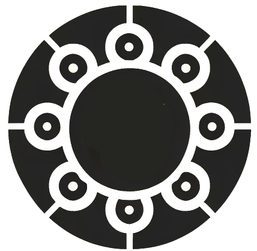

<p align="center">  </p> <div align="center"> <a href="https://test.pypi.org/project/mictlanx/"></a> </div> <div align="center"> <h1>Axo: <span style="font-weight:normal;">UI</span></h1> </div>

The Axo UI is a modern, user-friendly interface designed to interact seamlessly with the Axo Backend. Built with Vue.js and Vuetify, this interface empowers users to create, manage, and interact with active objects efficiently and intuitively.

---

## ⚙️ Prerequisites
Ensure you have the following installed before running the project:

- Node.js 18+
- npm (for package management)
- A running instance of the **[Axo Backend](https://github.com/fatimacm/axo-backend)**

---

## 🚀 Installation
### Step 1: Clone the repository
```sh
git clone https://github.com/fatimacm/axo-ui.git
cd axo-ui
```

### Step 2: Install dependencies
```sh
npm install
```

---

## ▶️ Usage
### Run development server:
```sh
npm run dev
```
This will start the development server on http://localhost:5173/.

### Build for production:
```sh
npm run build
```
This command prepares the application for deployment by generating optimized files in the **dist** folder. Use this step only when the application is ready for production.

---


## 🌐 Documentation
Detailed API documentation is available through the backend:

Swagger UI: http://localhost:17000/docs

---

## 💬 Contributing
Pull requests are welcome! For major changes, please open an issue first to discuss what you'd like to propose. ❤️

